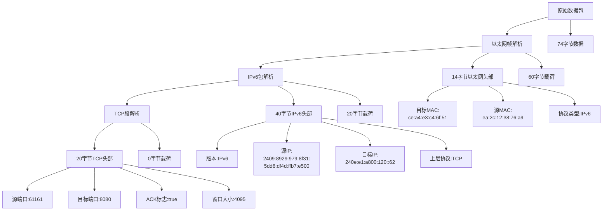

# 数据包解析示例

## 示例数据包解析

以下是一个实际数据包的解析示例：

```text
PACKET: 74 bytes, wire length 74 cap length 74 @ 2025-10-08 22:42:31.195898 +0800 CST
- Layer 1 (14 bytes) = Ethernet {Contents=[..14..] Payload=[..60..] SrcMAC=ea:2c:12:38:76:a9 DstMAC=ce:a4:e3:c4:6f:51 EthernetType=IPv6 Length=0}
- Layer 2 (40 bytes) = IPv6     {Contents=[..40..] Payload=[..20..] Version=6 TrafficClass=0 FlowLabel=656896 Length=20 NextHeader=TCP HopLimit=254 SrcIP=2409:8929:979:8f31:5dd6:df4d:ffb7:e500 DstIP=240e:e1:a800:120::62 HopByHop=nil}
- Layer 3 (20 bytes) = TCP      {Contents=[..20..] Payload=[] SrcPort=61161 DstPort=8080(http-alt) Seq=3143153943 Ack=3304574436 DataOffset=5 FIN=false SYN=false RST=false PSH=false ACK=true URG=false ECE=false CWR=false NS=false Window=4095 Checksum=21475 Urgent=0 Options=[] Padding=[]}
```

## 解析结构图



## 各层详细信息

### 1. 链路层 (Ethernet Layer)
- **类型**: Ethernet
- **大小**: 14字节
- **源MAC地址**: ea:2c:12:38:76:a9
- **目标MAC地址**: ce:a4:e3:c4:6f:51
- **上层协议**: IPv6

### 2. 网络层 (IPv6 Layer)
- **类型**: IPv6
- **大小**: 40字节
- **版本**: 6
- **源IP地址**: 2409:8929:979:8f31:5dd6:df4d:ffb7:e500
- **目标IP地址**: 240e:e1:a800:120::62
- **上层协议**: TCP
- **跳数限制**: 254

### 3. 传输层 (TCP Layer)
- **类型**: TCP
- **大小**: 20字节
- **源端口**: 61161
- **目标端口**: 8080 (HTTP替代端口)
- **序列号**: 3143153943
- **确认号**: 3304574436
- **标志位**: ACK=true (仅ACK标志被设置)
- **窗口大小**: 4095
- **载荷大小**: 0字节

## 解析代码示例

```go
// 分层输出数据包信息
func printPacketDetails(packet gopacket.Packet) {
    // 基本信息
    fmt.Printf("PACKET: %d bytes, wire length %d cap length %d @ %v\n",
        len(packet.Data()),
        packet.Metadata().CaptureInfo.Length,
        packet.Metadata().CaptureInfo.CaptureLength,
        packet.Metadata().Timestamp)

    // 遍历并输出每一层的信息
    layers := packet.Layers()
    for i, layer := range layers {
        fmt.Printf("- Layer %d (%d bytes) = %s {%+v}\n",
            i+1,
            len(layer.LayerContents()),
            layer.LayerType().String(),
            layer)
    }

    // 输出特定层的详细信息
    if linkLayer := packet.LinkLayer(); linkLayer != nil {
        fmt.Printf("  Link Layer: %+v\n", linkLayer)
    }

    if networkLayer := packet.NetworkLayer(); networkLayer != nil {
        fmt.Printf("  Network Layer: %+v\n", networkLayer)
    }

    if transportLayer := packet.TransportLayer(); transportLayer != nil {
        fmt.Printf("  Transport Layer: %+v\n", transportLayer)
    }

    if appLayer := packet.ApplicationLayer(); appLayer != nil {
        fmt.Printf("  Application Layer: %+v\n", appLayer)
        fmt.Printf("    Payload: %s\n", string(appLayer.Payload()))
    }
}
```

## 总结

这个数据包是一个从端口61161到端口8080的TCP确认包，不包含应用层数据。它可能是HTTP通信过程中的一个确认包，用于维护TCP连接状态。