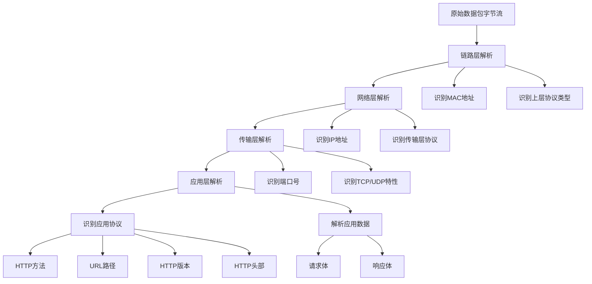

# 数据包(Packet)组成与解析

## 1. 数据包组成结构图

```mermaid
graph TD
    A[数据包 Packet] --> B[链路层 Link Layer]
    A --> C[网络层 Network Layer]
    A --> D[传输层 Transport Layer]
    A --> E[应用层 Application Layer]
    
    B --> B1[Ethernet帧]
    B1 --> B11[目标MAC地址]
    B1 --> B12[源MAC地址]
    B1 --> B13[类型/长度]
    B1 --> B14[数据载荷]
    
    C --> C1[IP数据包]
    C1 --> C11[版本]
    C1 --> C12[头部长度]
    C1 --> C13[服务类型]
    C1 --> C14[总长度]
    C1 --> C15[标识符]
    C1 --> C16[标志位]
    C1 --> C17[片偏移]
    C1 --> C18[生存时间]
    C1 --> C19[协议类型]
    C1 --> C110[头部校验和]
    C1 --> C111[源IP地址]
    C1 --> C112[目标IP地址]
    
    D --> D1[TCP/UDP段]
    D1 --> D11[源端口号]
    D1 --> D12[目标端口号]
    D1 --> D13[序列号]
    D1 --> D14[确认号]
    D1 --> D15[头部长度]
    D1 --> D16[标志位]
    D1 --> D17[窗口大小]
    D1 --> D18[校验和]
    D1 --> D19[紧急指针]
    D1 --> D110[选项]
    D1 --> D111[数据载荷]
    
    E --> E1[HTTP/HTTPS数据]
    E1 --> E11[请求行/状态行]
    E1 --> E12[请求头/响应头]
    E1 --> E13[空行]
    E1 --> E14[消息体]
```



## 2. 数据包解析流程图



## 3. gopacket解析器工作原理

```mermaid
graph TD
    A[gopacket.PacketSource] --> B[数据包通道]
    B --> C[循环读取数据包]
    C --> D[分层解析]
    D --> E[链路层Layer]
    D --> F[网络层Layer]
    D --> G[传输层Layer]
    D --> H[应用层Layer]
    
    E --> E1[LinkLayer()方法]
    F --> F1[NetworkLayer()方法]
    G --> G1[TransportLayer()方法]
    H --> H1[ApplicationLayer()方法]
    
    H1 --> H11[Payload数据]
    H11 --> H111[HTTP请求解析]
    H111 --> H1111[方法提取]
    H1111 --> H1112[URL提取]
    H1111 --> H1113[头部字段提取]
```

## 说明

1. **数据包组成**：网络数据包按照OSI七层模型进行封装，每一层都添加自己的头部信息
2. **解析流程**：gopacket库按照从底层到高层的顺序逐层解析数据包
3. **访问方法**：可以通过特定的方法访问各层数据，如LinkLayer()、NetworkLayer()等
4. **应用层数据**：HTTP等应用层协议数据位于最上层，可通过ApplicationLayer().Payload()获取